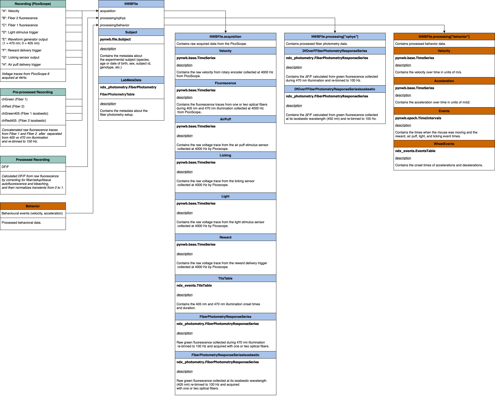

# Notes concerning the azcorra2023 conversion

Simultaneous traces (velocity from rotary encoder, trigger signals for reward, air puff and light stimuli delivery,
licking from a lick sensor, fluorescence detected by photomultiplier tubes (PMTs) from one or two optic fibers and
output from waveform generator used to alternate 405-nm and 470-nm illumination every 10 ms) were collected at 4 kHz
by a `PicoScope 6` data acquisition system.

## Folder structure

Recordings are organized in folders indicating the batch of mice. Within them, each mouse has its own folder, with
further folders inside, one per recording as saved by `Picoscope`. Recordings are labelled with the date, so a set of
recordings in one session will all be labelled with the date and a number.

### Picoscope default folder structure

Each set of recording folders must be inside a folder named as 'experiment type-mouse ID' - example 'VGlut-A997'.
All recording sets from the same mouse should be in this same folder.

Each recording in a set from a single mouse and session should be named as 'date-recording number', where
recording number = number within the recording set and is 4 digits long: yyyymmdd-00##.

    2020-02-26 Vglut2/  # experiment folder
    └── VGlut-A997/  # subject folder
        ├── 20200129-0001/  # session folder
        │   ├── 20200129-0001_01.mat  # individual recordings that belong to the same session
        │   ├── 20200129-0001_02.mat
        │   ├── ...
        │   ├── 20200129-0001_20.mat
        │   ├── 20200129-0001_21.mat

### Picoscope data

The variables in Picoscope (e.g. `20200129-0001_01.mat`)  are as follows:

- `A` = velocity (chMov)
- `B` = fiber 2 fluorescence (from here on called channel red - chR)
- `C` = fiber 1 fluorescence (channel green - chG)
- `D` = light stimulus trigger
- `E` = waveforem generator output indicating illumination wavelength (1 = 470nm, 0 = 405nm)
- `F` = reward delivery trigger
- `G` = licking sensor ourput
- `H` = air puff delivery trigger

### Concatenated recordings

Based on this preprocessing script, they are concatenating the raw recordings (fluorescence and behavior) and
separating the fluorescence from 470 nm vs 405 nm (isosbestic control) illumination, and saving it as a binned file
(re-bins the data from 4 kHz to 100 Hz).
The script outputs a .mat file named as 'Binned405_(experiment)-(mouseID)-(recording date yyyymmdd).mat' with a `T`
named structure in it.

Picoscope -> "binned" variable names

```python
dict(
  A="chMov",
  B="chRed",
  C="chGreen",
  D="Light",
  E="ch470",
  F="Reward",
  G="Licking",
  H="AirPuff",
)
```
The separated fluorescence is saved to `"chRed405"` and `"chGreen405"` variables.

### Processed recordings

The following steps are done to raw recordings based on their [analysis code](https://github.com/DombeckLab/Azcorra2023/tree/main/Fiber%20photometry%20data%20analysis):

1. **Concatenate raw data** collected on `Picoscope`, and separate the fluorescence due to 405 vs 470 nm illumination (405 nm is GCaMP's isosbestic point and thus serves as a movement control), and re-bins the data from 4 kHz to 100 Hz.
2. **Calculate DF/F** from raw fluorescence by correcting for fiber/setup/tissue autofluorescence and bleaching, and then normalizes transients from 0 to 1 (saving the normalization value to allow reverting it). It also converts velocity from Volts as read out from the rotary encoder to m/s. (see [code](https://github.com/DombeckLab/Azcorra2023/blob/main/Fiber%20photometry%20data%20analysis/Data%20pre%20processing/data_processing.m))
3. Select behavioral events used to obtain triggered averages (rewards, air puffs, accelerations...)
4. Determine exclusion criteria for each recording to decide which will be included for analysis (running time, signal-to-noise ratio)

The output is saved to a .mat file (`data6.mat`) which contains the experiment type, subject identitifier, date of
experiment, baseline fluorescence, normalized DF/F (normalised from 0 to 1), also contains the recording location and
mouse sex etc.

Variables

- `Exp`: experiment name
- `Mouse`: subject identifier
- `Date`: date of experiment
- `data`: final DF/F, velocity in m/s and acceleration is m/s2
- `depthG`: the depth of the fiber (Green channel)
- `depthR`: the depth of the fiber (Red channel)
- `Day`: 1, 2, or 3
- `Type`: experiment type
- `RunRew`: whether the animal was running or receiving reward
- `chG`: the location of fiber?
- `chR`: the location of fiber?
- `Gen`: the sex of the mouse
- `cropStart`: the crop point (if 405 channel shows many movement artifacts (rare), exclude recording if the start of
   the recording is still decaying after the initial correction, crop it off)
- `base`: baseline fluorescence
- `norm`: normalized DF/F
- `flip`, `dup`:  a recording with data for chG and chR will be duplicated and one of the copies with have chG/chR flipped
- `timeRun`: the time the mouse spent running in each recording
- `sig2noise`: only use recordings with signal-to-noise ratios above 10
- `exStr`: which recordings are made in axons vs cell bodies (1 = axons, 0 = cell bodies snc/vta, nan = empty)
- `exSig2Noise`: which recordings have high enough signal to noise ratio (1 = good, 0 = bad)
- `exRun`: which recordings have enough running time to include for movement analysis (1 = good, 0 = bad)
- `Acc405`:  The max value of cross-correlation between the 405 channel for each fiber (used to determine eligibility for locomotion analysis)
- `ex405Acc`: which recordings must be excluded from locomotion analyhave due to high correlations between the 405 ch and acceleration  (1 = good, 0 = bad, nan = not enough running)
- `exBothCh`: which recording pairs have both fibers (chG and chR) with signal-to-noise ratios above thresh, for dual comparisons (1 = good, 0 = bad)
- `exSNcStr`: which recording pairs have one fiber in SNc and one in striatum, for simultaneous comparisons of somas and axons  (1 = good, 0 = bad)
- `RG405`:  The max value of averaging over cross-correlation between the 405 in one fiber vs the 470 of the other and vice versa (used to determine eligibility for dual omparisons between simultaneous recordings.)
- `exRG405`: which recording must be EXCLUDED from simultaneous fiber-to-fiber comparisons due to high correlation between the 405 and 470 channels of opposite fibers (1 = good, 0 = bad)
- `Bad405All`: which recordings have too many artifacts in the 405 channel (1 = bad, 0 = good, nan = not enough sig2noise)
- `RecLocG`
- `RecLocRmm`: recording location of Red channel in units of mm
- `RecLocGmm`: recording location of Green channel in units of mm
- `RecLocRshift`
- `RecLocGshift`

```
fibers = {'chGreen' 'chRed'};
```

### NWB mapping

The following table describes the initial mapping between the source data and the NWB file:



### References
- Azcorra 2023 [manuscript](https://www.nature.com/articles/s41593-023-01401-9)

- Raw fiber photometry recordings on [Zenodo](https://zenodo.org/records/7871634)

- Processed fiber photometry recordings on [Zenodo](https://zenodo.org/records/7871982)

- PicoScope [manual](https://www.picotech.com/download/manuals/picoscope-6-users-guide.pdf)

- Data processing [script](https://github.com/DombeckLab/Azcorra2023/blob/main/Fiber%20photometry%20data%20analysis/Data%20pre%20processing/concatPhot405.m) in MATLAB from Dombeck to concat PicoScope recordings
