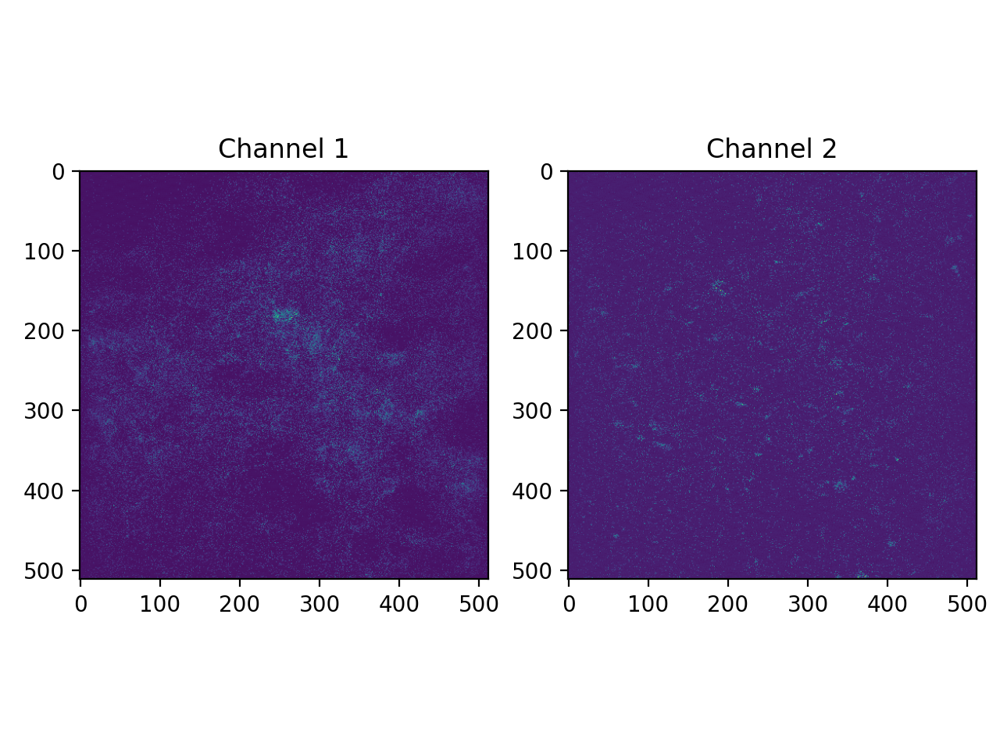
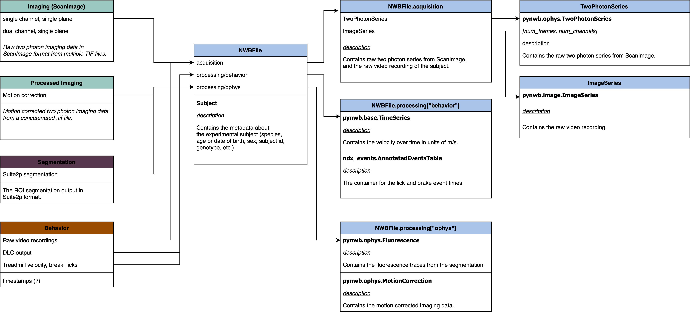

# Notes concerning the nagappan_embargo_2023 conversion

For this ongoing data collection, two-photon imaging data is being recorded from cell bodies and axons
in the striatum of mice running on a treadmill.

The imaging data from one or two optical channels was acquired at 30.0421 Hz using ScanImage
and saved in multiple TIF files, each file contains 4000 frames for each channel.

## ScanImage data

The example imaging sessions that we received consists of multiple TIF files in ScanImage format.
In each TIF the video shape is (4000, 512, 512) for single channel, and (8000, 512, 512) for two channels.

"Channel 1" is recorded from cell bodies and "Channel 2" is recorded from axons located in the striatum.
The excitation wavelengths for the two channels are: 920 nm for Channel 1 (Green) and 1070 nm for Channel 2 (Red).

### NWB mapping

The following table describes the initial mapping between the source data and the NWB file:

